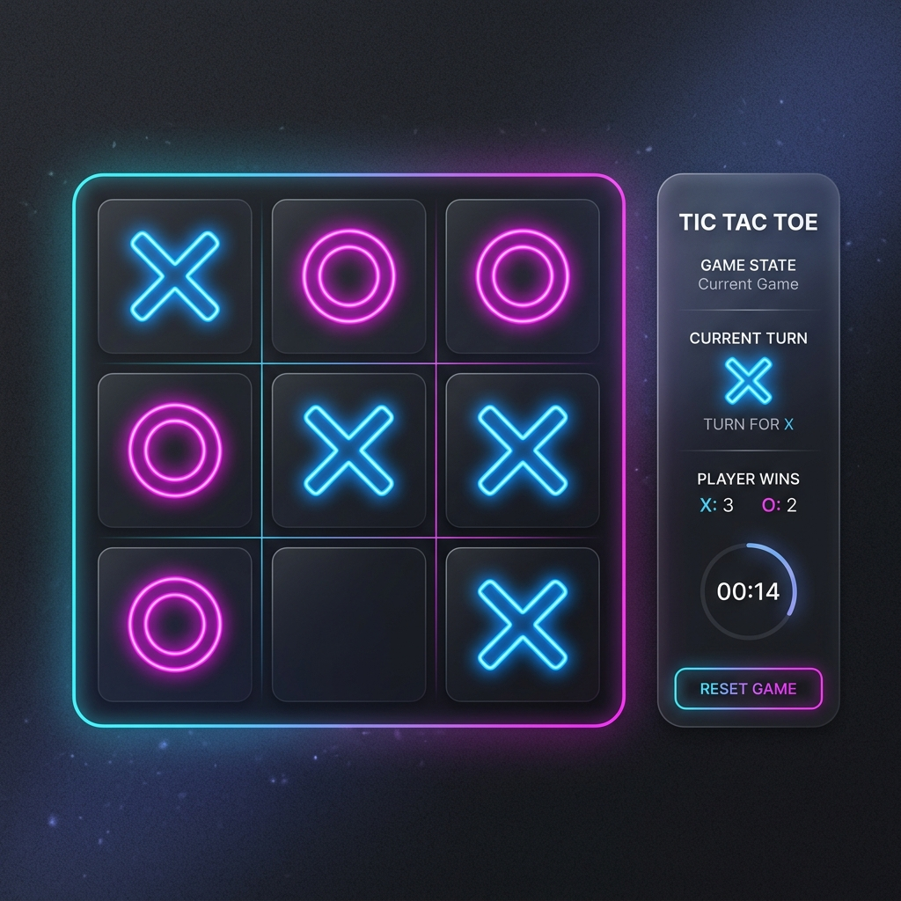

# Tic Tac Toe - Modern Web Edition



## 🎮 Overview

A clean, responsive, and modern implementation of the classic Tic Tac Toe game. Built with pure web technologies, this project features a sleek dark-themed UI, smooth animations, and intelligent game logic.

This project was originally conceived in 2022 and has been professionalized and updated in 2026.

## ✨ Features

- **Responsive Design**: Works perfectly on desktops, tablets, and mobile devices.
- **Player Customization**: Choose whether you want to start as 'X' or 'O'.
- **Interactive Gameplay**: Smooth transitions and hover effects.
- **Win Detection**: Automatically detects horizontal, vertical, and diagonal wins with a visual strike-through.
- **Draw Detection**: Recognizes when the game has ended in a stalemate.
- **One-Click Reset**: Quickly start a new round at any time.

## 🛠️ Tech Stack

- **HTML5**: Semantic structure for the game grid and interface.
- **CSS3**: Modern styling with Flexbox, CSS Grid, and responsive media queries.
- **JavaScript (ES6+)**: Core game logic and DOM manipulation.

## 🚀 Getting Started

1. Clone the repository:
   ```bash
   git clone https://github.com/rajjitlai/Tic_Tac_Toe.git
   ```
2. Open `index.html` in your favorite web browser.
3. Enjoy the game!

## 📜 License

This project is licensed under the MIT License - see the [LICENSE](LICENSE) file for details.

---

**Developed with ❤️ by Rajjit Laishram, 2026**
